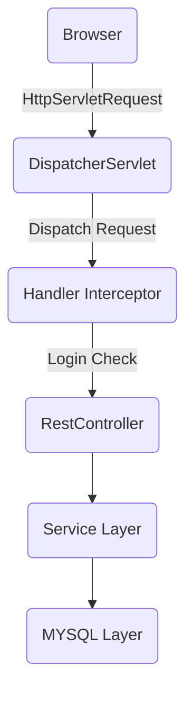

# End Of Period

## 期末作业 有关宿舍的增删改查 (后端部分)

## 我认为它不能称之为系统 毕竟太简陋了..

---

### 写这个玩意时候的开发工具及相关版本信息

- IntelliJ IDEA 2022.1.1 (Ultimate Edition)
- Tomcat 9.0.58
- MySQL 5.7.36
- Oracle JDK Version 11.0.15
- Apache Maven 3.8.5

#### _It is better to specify character encoding to reduce problems caused by character sets_

##### _how to get your database character sets_

```sql
SHOW
VARIABLES LIKE '%char%'
```

```text
character_set_client	    utf8mb4
character_set_connection    utf8mb4
character_set_database	    utf8mb4
character_set_filesystem    binary
character_set_results	    utf8mb4
character_set_server	    utf8mb4
character_set_system	    utf8
character_sets_dir	    /usr/share/mysql/charsets/
```

---

### *Main Technology Stack*

* Spring
* SpringWebMVC
* Mybatis
* Druid
* Lombok
* Validation
* JackSon
* HuTool

---

### *怎么把它跑起来 ?*

- Roughly 15 minutes
- An IDE
- JDK 11+ installed with JAVA_HOME configured appropriately
- Apache Maven 3.8.1+

### *Architecture*



---

### *Search For Help*

- <https://cn.bing.com>
- <a href="mailto:authabc@163.com">Mail to me</a>
- *Tips: Please Make sure your development environment and tools are properly set to UTF-8 encoding set !*


